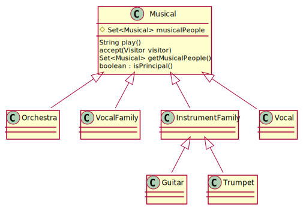

# Pattern Matching Orchestra examples

This project exists to provide references and code examples that accompany the article "Pattern Matching maakt Java in de komende jaren nóg krachtiger" that appeared in [Java Magazine](https://nljug.org/java-magazine) #2-2021.

## References

1. https://openjdk.java.net/jeps/305
2. In dit artikel gebruiken we codevoorbeelden die gaan over een orkest, dat bestaat uit verschillende muzikanten. De code is beschikbaar via https://github.com/MrFix93/pattern-matching-orchestra.
3. http://openjdk.java.net/jeps/8213076
4. In dit artikel beschrijven we toekomstige features zoals die beschreven worden in JEP-drafts en de visie van de ontwikkelaars van Java. De exacte invulling kan dus nog wijzigen.
5. https://openjdk.java.net/jeps/286
6. https://cr.openjdk.java.net/~briangoetz/amber/serialization.html
7. “Java 14” (Ivo Woltring) - Java Magazine #2-2020.
8. “Pattern Matching for Java” (Gavin Bierman, Brian Goetz) - https://cr.openjdk.java.net/~briangoetz/amber/pattern-match.html

## Premise

The code in this project focuses on representing data on an *orchestra* and its *musicians*. 
Every contributing member to the orchestra is modeled as a sub class of the `Musical` abstract class.
An orchestra - or any musical group for that matter - can be modeled as a `Set` of [Musical](https://github.com/MrFix93/pattern-matching-orchestra/blob/97b54b6c900b44541294041c65cedf0caddaca0e/src/main/java/nl/infosupport/models/Musical.java)`s.



## Factory method `ensemble`

An orchestra can be created as follows:

``` java
Orchestra twoTrumpetPlayers = Orchestra.ensemble(
      new Trumpet(true, "Wilco"), 
      new Trumpet(false, "Max")
);
Orchestra twoSingers = Orchestra.ensemble(
      Vocal.leadSinger("Raymond"), 
      Vocal.backgroundSinger("Daan")
);
Orchestra brassBand = Orchestra.ensemble(
      new Guitar(true, "Peter"), 
      new Trumpet(true, "Wilco"), 
      Vocal.leadSinger("Raymond")
);
```

## Grouping

Big orchestras are organized by defining *instrument families*. These `*Family` classes are all sub classes of `Musical`.

``` java
Orchestra philharmonic = Orchestra.ensemble(
      InstrumentFamily.ensemble(
            new Guitar(true, "Peter"), 
            new Guitar(false, "Tom")
      ),
      InstrumentFamily.ensemble(
            new Trumpet(true, "Wilco"), 
            new Trumpet(false, "Max")
      ),
      InstrumentFamily.ensemble(
            new Violin(true, "Topol"),
            new Violin(false, "André"),
            new Violin(false, "Henrietta")
      ),
      InstrumentFamily.ensemble(
            new Drums(true, "Phil"), 
            new Timpani(true, "Julia"), 
            new Triangle(true, "Smee")
      ),
      VocalFamily.ensemble(
            Vocal.leadSinger("Raymond"), 
            Vocal.backgroundSinger("Daan"), 
            Vocal.backgroundSinger("Hannah")
      )
);
```
